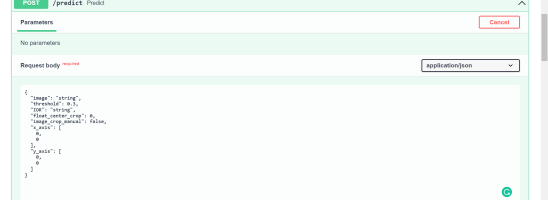
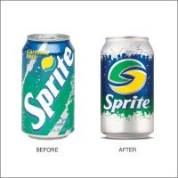
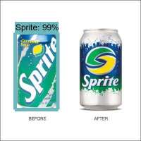
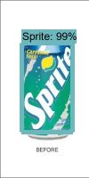
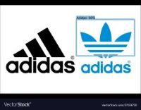
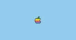
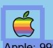

# TF1

We know TF1 is Object Detection Library is old but in our Case we have efficiently 
implementation so that it has fast as compare to tf2,detectron2 in our project.

Warning (In tf1 model i have used Mobilenetv1 )

# BrandRecognition

A brand logo detection system using Detectron2 API. This API will detect the type of logo in the image and this API is also compatible to Accept the Region of interest(ROI) of the detection object 

Acceptable ROI :  ['TOP','BUTTOM','LEFT',RIGHT','CENTER CROP(precentage in float value)']
Also Create ROI For (x_axis and y_axis) in IORpreprocessing.py file. But we are not integrate with api. 

## Dataset for Brand_recognition

 Download the flickr logos 27 dataset from [here](http://image.ntua.gr/iva/datasets/flickr_logos/).
 
 We have added 2 classes tata and reliance dataset from [here](https://drive.google.com/file/d/1WikYMsqYD9KI-VZy8JfxXJv7TwUkvfx4/view)
 

   The flickr logos 27 dataset contains 27 classes of brand logo images downloaded from Flickr. The brands included in the dataset are: Adidas, Apple, BMW, Citroen, Coca Cola, DHL, Fedex, Ferrari, Ford, Google, Heineken, HP, McDonalds, Mini, Nbc, Nike, Pepsi, Porsche, Puma, Red Bull, Sprite, Starbucks, Intel, Texaco, Unisef, Vodafone and Yahoo

   Also we have added 2 classes Reliance,Tata .


# Preprocessing steps done

1) There is no XML file attached, so you have to generate the XML file from the annotation text file.
2) Refer the Ipython notebooks in the Notebook folder for reference . ( will add .py file sooner)
3) In Ipython notebooks outputs generate the both .csv and .json files for tf1,tf2,detectron2

# How to use the Brand_Recognition FASTAPI in local

   ```bash
   $ git clone -b tf1  https://github.com/kkkumar2/Brand_Recognition.git
   ```
   ```python
   uvicorn app:app --reload
   ``` 
# Glimpse of how Fastapi with swagger ui will look



# Original sample image with Prediction (Full image detection)



#  Original sample with model outputs and Prediction examples (ROI based image detection LEFT)

!


# Prediction (ROI based image detection RIGHT)

|!!!

# # Prediction (ROI based image detection TOP)
!!!

## Prediction (Manually given ROI  image  detection)
!!!