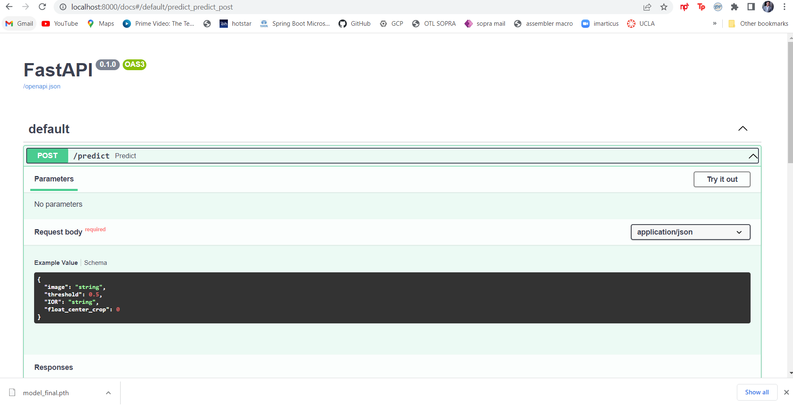
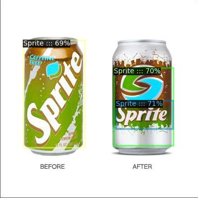

# Tensorflow Object detect 2 API

TensorFlow is an end-to-end open source platform for machine learning. It has a comprehensive, flexible ecosystem of tools, libraries, and community resources that lets researchers push the state-of-the-art in ML and developers easily build and deploy ML-powered applications.


# BrandRecognition

A brand logo detection system using Detectron2 API. This API will detect the type of logo in the image and this API is also compatible to Accept the Region of interest(ROI) of the detection object 

Acceptable ROI :  ['TOP','BUTTOM','LEFT',RIGHT','CENTER CROP']

## Dataset for Brand_recognition

 Download the flickr logos 27 dataset from [here](http://image.ntua.gr/iva/datasets/flickr_logos/).

   The flickr logos 27 dataset contains 27 classes of brand logo images downloaded from Flickr. The brands included in the dataset are: Adidas, Apple, BMW, Citroen, Coca Cola, DHL, Fedex, Ferrari, Ford, Google, Heineken, HP, McDonalds, Mini, Nbc, Nike, Pepsi, Porsche, Puma, Red Bull, Sprite, Starbucks, Intel, Texaco, Unisef, Vodafone and Yahoo.

   ```shell
   $ wget http://image.ntua.gr/iva/datasets/flickr_logos/flickr_logos_27_dataset.tar.gz
   $ tar zxvf flickr_logos_27_dataset.tar.gz
   $ cd flickr_logos_27_dataset
   $ tar zxvf flickr_logos_27_dataset_images.tar.gz
   $ cd ../
   ```

# Preprocessing steps done

1) There is no XML file attached, so you have to generate the XML file from the annotation text file.
2) Refer the Ipython notebooks in the Notebook folder for reference . ( will add .py file sooner)

# How to use the Brand_Recognition FASTAPI in local

   ```bash
   $ git clone https://github.com/kkkumar2/Brand_Recognition.git
   ```
   ```python
   uvicorn app:app --reload
   ``` 
# Glimpse of how Fastapi with swagger ui will look




# Original sample image
|||
|---|---|
|||


# Prediction examples (Full image detection)


|||

# Prediction examples (ROI based image detection LEFT)

||

# Prediction examples (ROI based image detection RIGHT)

||

# Prediction examples (ROI based image detection TOP)

||

# Prediction examples (ROI based image detection BOTTOM)

||

# Prediction examples (ROI based image detection CENTER RATO BASED CROP)

||

# Prediction examples (ROI based image detection X AXIS Y AXIS RATIO BASED CROP)

||


# deployment

Need to deploy the API