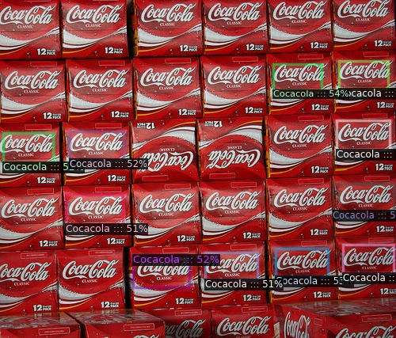

# BrandRecognition

A brand logo detection system using Detectron2 API.

Detectron2 is Facebook AI Research's next generation library that provides state-of-the-art detection and segmentation algorithms. It is the successor of Detectron and maskrcnn-benchmark. It supports a number of computer vision research projects and production applications in Facebook.

## Dataset Brand_recognition

 Download the flickr logos 27 dataset from [here](http://image.ntua.gr/iva/datasets/flickr_logos/).

   The flickr logos 27 dataset contains 27 classes of brand logo images downloaded from Flickr. The brands included in the dataset are: Adidas, Apple, BMW, Citroen, Coca Cola, DHL, Fedex, Ferrari, Ford, Google, Heineken, HP, McDonalds, Mini, Nbc, Nike, Pepsi, Porsche, Puma, Red Bull, Sprite, Starbucks, Intel, Texaco, Unisef, Vodafone and Yahoo.

   ```shell
   $ wget http://image.ntua.gr/iva/datasets/flickr_logos/flickr_logos_27_dataset.tar.gz
   $ tar zxvf flickr_logos_27_dataset.tar.gz
   $ cd flickr_logos_27_dataset
   $ tar zxvf flickr_logos_27_dataset_images.tar.gz
   $ cd ../
   ```

# Preprocessing steps done

1) There is no XML file attached, so you have to generate the XML file from the annotation text file.
2) Refer the Ipython notebooks in the Notebook folder for reference . ( will add .py file sooner)

# How to use the Brand_Recognition FASTAPI in local

   ```bash
   $ git clone https://github.com/kkkumar2/Brand_Recognition.git
   ```
   ```python
   uvicorn app:app --reload
   ``` 
# Glimpse of how Fastapi with swagger ui will look

||

# Prediction examples

||

# deployment

Need to deploy the API